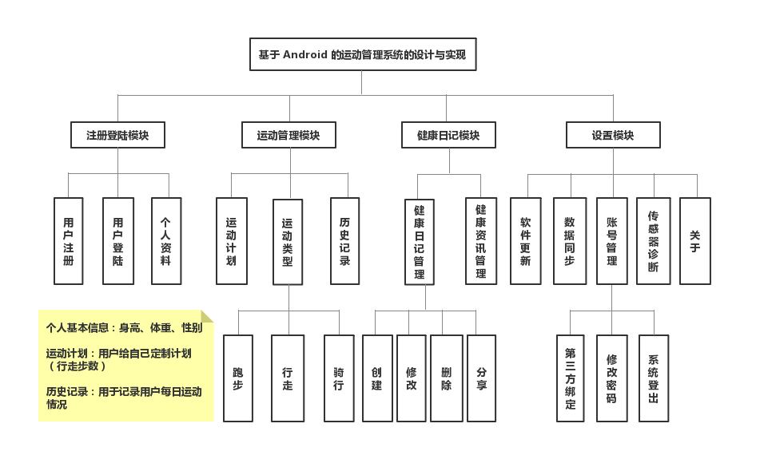

# 运动管理系统

------

基于Android的运动管理系统

功能模块图：

已实现功能：
- 计步功能
- 锻炼计划及提醒功能
- 用户注册登陆
- 用户信息显示
- 步数历史信息

todo
- [x] 历史数据下拉刷新
- [ ] 所有用户数据存储服务器
- [ ] 头像上传存储
- [ ] 运动图片轮显
- [ ] 健康资讯模块（API）
- [ ] GPS轨迹绘制
- [ ] 周、月维度运动报告
- [ ] 自定义标题栏
- [ ] 跑步、步行、骑行多模式适配

使用技术

- SQLite数据库
- Litepal框架
- SharePerference
- 安卓网络编程
- 异步请求 AsyncTask
- 头像图片选择
- Material Design 设计规范

后端系统

- Spring Boot微服务架构 整合 Spring Data JPA
- MySQL 数据库